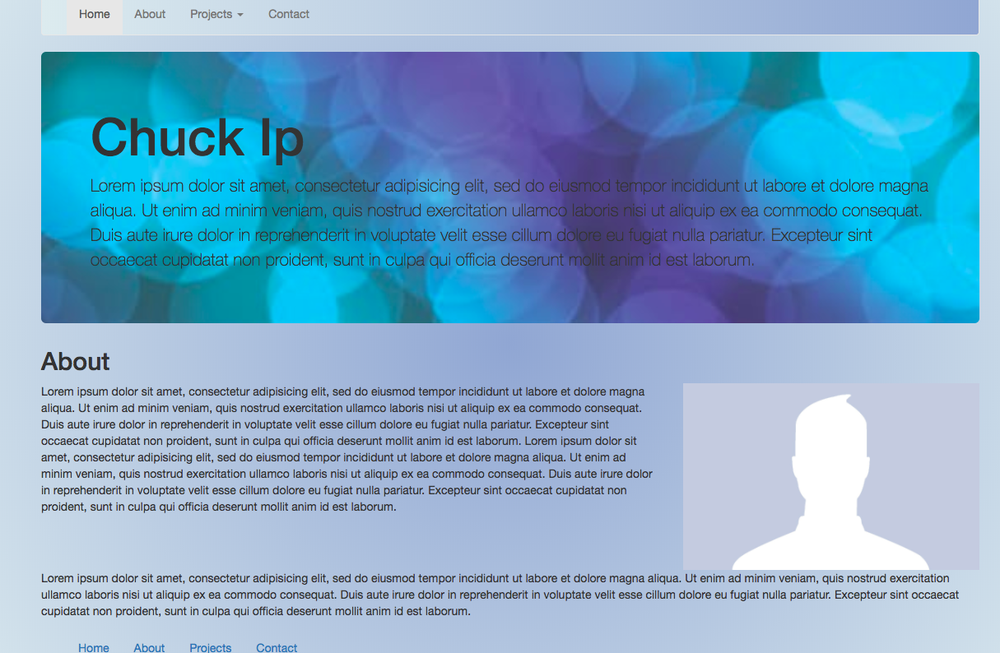
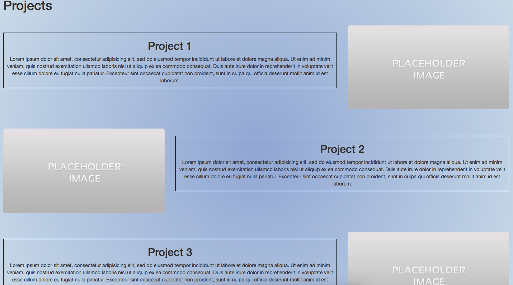
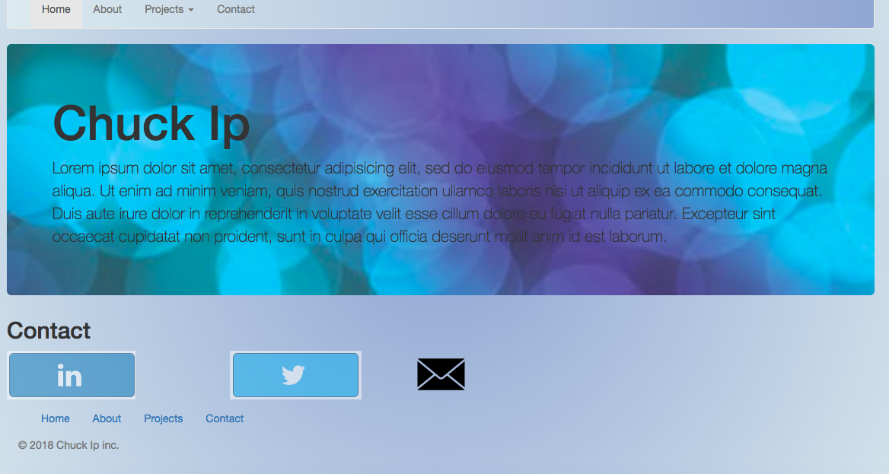

# sparta-global-portfolio

Instructions for use:

* To use this project git clone the repository to your computer
* Enter the project and open the html file. To view the code you can open the html file in a text editor.

For this project I was required to create a template for my online portfolio using just HTML5 and CSS3.

## Features:

* Landing page
* Navigation bar(functional carousel)
* Jumbotron
* About section (including profile picture)
* Projects page (including pictures of projects)
* contact page (links to social media)

 

 

 

 
